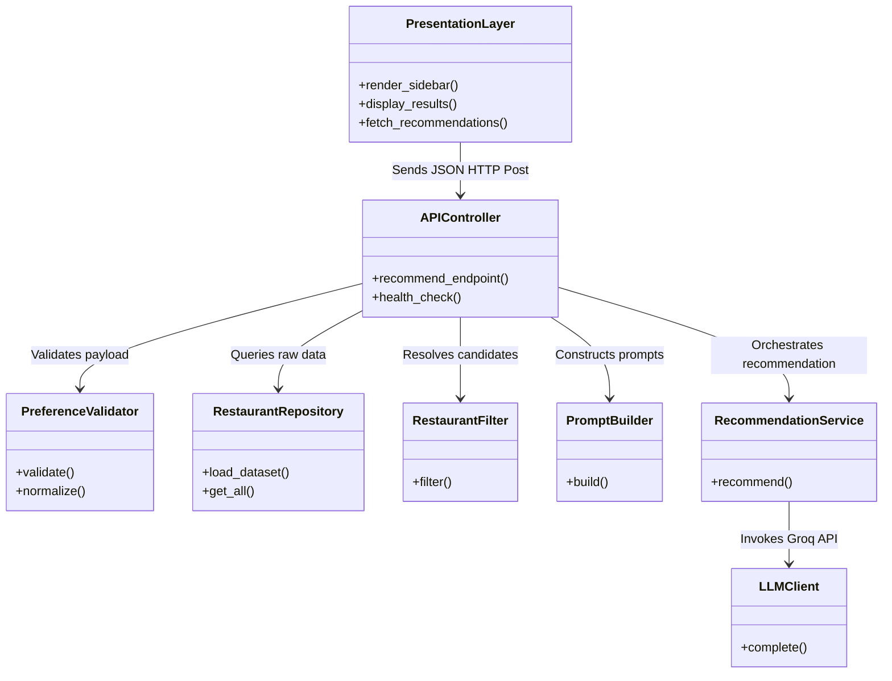
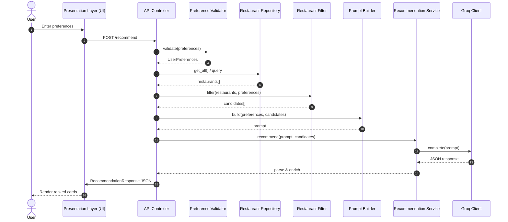
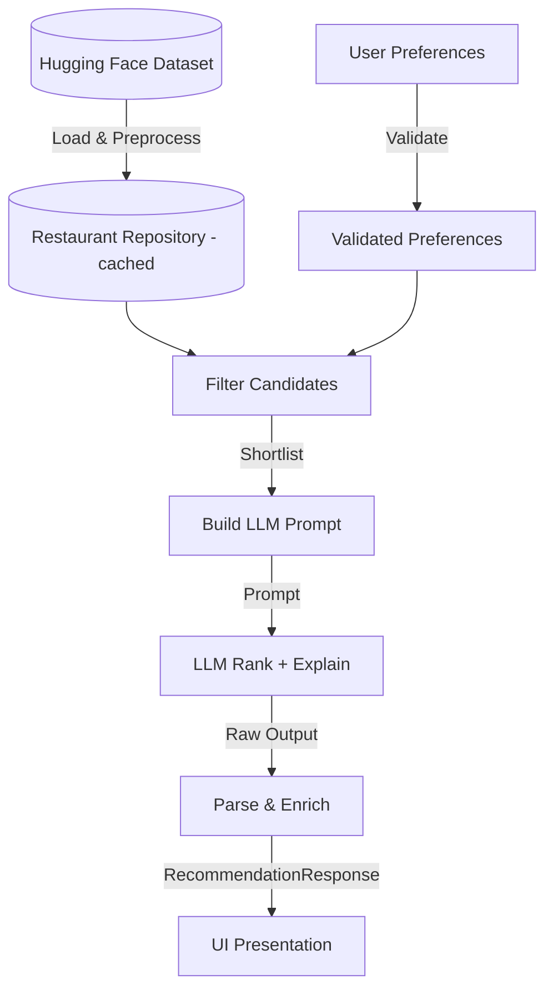
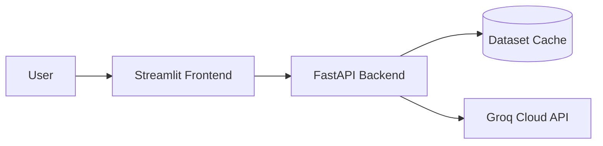
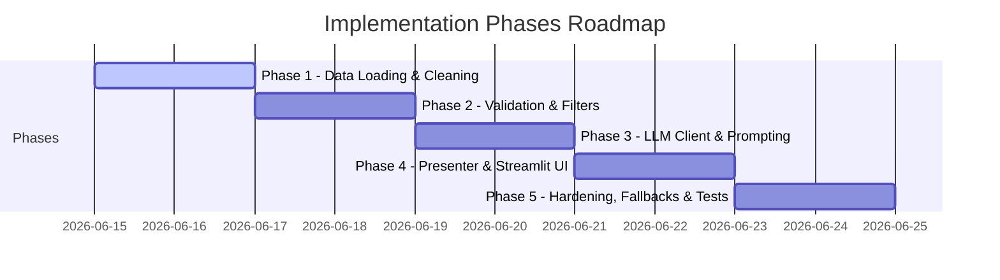

# Architecture Design: AI-Powered Restaurant Recommendation System

This document describes the technical architecture for the Zomato-inspired restaurant recommendation service defined in [context.md](file:///Users/vkg/Downloads/google-cloud-sdk/Docs/context.md). The system combines structured restaurant data from Hugging Face with Groq LLM inference to produce personalized, explainable recommendations.

---

## 1. Architecture Goals

| Goal | Description |
| :--- | :--- |
| **Separation of Concerns** | Data loading, filtering, LLM reasoning, and presentation are isolated modules with clear interfaces. |
| **Deterministic Pre-Filtering** | Hard constraints (location, budget, rating) are applied before the LLM to reduce token cost and hallucination risk. |
| **Explainability** | Every recommendation includes an LLM-generated rationale tied to user preferences. |
| **Extensibility** | Swap UI frameworks or data sources without rewriting core logic; LLM access is isolated behind a Groq adapter. |
| **Testability** | Pure functions for filtering/ranking preparation; mockable LLM adapter for unit tests. |

---

## 2. High-Level Component Interactions

To provide a clear division of responsibilities, the class structure and interactions between components are defined as follows:



---

## 3. Component Architecture

### 3.1 Data Ingestion Layer
**Responsibility:** Load, normalize, and cache the Zomato dataset once at startup (or on first request).

| Component | Role |
| :--- | :--- |
| **DatasetLoader** | Fetches `ManikaSaini/zomato-restaurant-recommendation` via Hugging Face `datasets`. |
| **DataPreprocessor** | Maps raw columns to a canonical schema, handles nulls, and normalizes text fields. |
| **RestaurantRepository** | In-memory query interface over the preprocessed dataset. |

#### Canonical Restaurant Schema
```python
Restaurant = {
    "id": str,              # Stable identifier (index or dataset id)
    "name": str,
    "location": str,        # City / locality
    "cuisines": list[str],  # e.g., ["Italian", "Continental"]
    "cost_for_two": int,    # Numeric cost indicator
    "rating": float,        # e.g., 4.2
    "votes": int,           # Optional: popularity signal
    "rest_type": str,       # Optional: casual dining, cafe, etc.
}
```

#### Preprocessing Steps
1. Download dataset split (typically `train`).
2. Select and rename relevant columns to the canonical schema.
3. Parse cuisine strings into lists (e.g., `"Italian, Chinese"` $\to$ `["Italian", "Chinese"]`).
4. Coerce rating and cost to numeric types; drop or impute invalid rows.
5. Normalize location strings (trim, title-case, alias map for city names).
6. Derive `budget_tier` from `cost_for_two` using configurable thresholds:

| Tier | Typical `cost_for_two` range (INR) |
| :--- | :--- |
| **low** | $\le$ 500 |
| **medium** | 501 – 1500 |
| **high** | $>$ 1500 |

*Note: Thresholds should be tuned after inspecting the actual dataset distribution.*

**Caching Strategy:** Load once into a pandas DataFrame or list of `Restaurant` objects. Persist a local Parquet/CSV snapshot to avoid repeated Hugging Face downloads during development.

---

### 3.2 User Input Layer
**Responsibility:** Collect, validate, and normalize user preferences.

#### Input Model
```python
UserPreferences = {
    "location": str,           # Required
    "budget": str,             # "low" | "medium" | "high"
    "cuisine": str | None,     # Optional primary cuisine
    "min_rating": float,       # e.g. 3.5
    "additional": str | None,  # Free-text: "family-friendly, quick service"
}
```

| Component | Role |
| :--- | :--- |
| **PreferenceForm** | UI form or CLI prompt collecting fields. |
| **PreferenceValidator** | Enforces required fields, enum values, and rating bounds. |
| **PreferenceNormalizer** | Lowercases cuisine, maps city aliases, and trims free text. |

#### Validation Rules
- **location:** non-empty; must match at least one value in the dataset (or suggest closest matches).
- **budget:** one of `low`, `medium`, `high`.
- **min_rating:** float in range `[0.0, 5.0]`.
- **cuisine:** optional; fuzzy match against known cuisine vocabulary extracted from dataset.
- **additional:** optional free text passed through to the LLM for soft matching.

---

### 3.3 Integration Layer
**Responsibility:** Apply hard filters, rank candidates heuristically, and assemble the LLM prompt.

This layer sits between structured data and the LLM. It ensures the model only reasons over a bounded, relevant candidate set.

#### 3.3.1 Restaurant Filter
Applies deterministic filters in sequence:
$$\text{All Restaurants} \to \text{Filter by Location} \to \text{Filter by Budget Tier} \to \text{Filter by Rating} \to \text{Filter by Cuisine} \to \text{Sort by Rating \& Votes} \to \text{Take Top N (15-20)}$$

| Component | Role |
| :--- | :--- |
| **RestaurantFilter** | Executes filter pipeline; returns `list[Restaurant]`. |
| **CandidateSelector** | Caps result count and applies tie-breaking rules. |

*Rule:* If zero candidates remain, relax constraints in order: `cuisine` $\to$ `budget` $\to$ `min_rating`, and surface a warning to the user.

#### 3.3.2 Prompt Builder

| Component | Role |
| :--- | :--- |
| **PromptBuilder** | Dynamically constructs prompts injecting candidate restaurants and preferences. |

Constructs a structured prompt containing:
- **System instructions:** Role, output format (JSON), ranking criteria.
- **User preferences:** Serialized `UserPreferences`.
- **Candidate restaurants:** Compact JSON array of filtered restaurants.
- **Task:** Rank top K (e.g. 5), explain each pick, optionally summarize.

**Design Principles:**
1. Require JSON output from the LLM for reliable parsing.
2. Include restaurant `id` in candidates so explanations map back to structured data.
3. Instruct the model to only recommend from the provided list (no fabrication).
4. Pass additional preferences as soft signals the LLM may use in ranking/explanation.

---

### 3.4 Recommendation Engine (LLM Layer)
**Responsibility:** Invoke the LLM, handle retries, parse and validate the response, merge with structured data.

| Component | Role |
| :--- | :--- |
| **LLMClient** | Thin adapter over the Groq API via the official `groq` Python SDK. |
| **RecommendationService** | Orchestrates prompt $\to$ LLM $\to$ parse $\to$ enrich. |
| **ResponseParser** | Parses JSON, validates schema, and handles malformed output. |
| **RecommendationEnricher** | Joins LLM ranks/explanations with full restaurant records. |

#### Output Models
```python
Recommendation = {
    "rank": int,
    "name": str,
    "cuisine": str,           # Joined cuisine string for display
    "rating": float,
    "estimated_cost": int,    # cost_for_two
    "explanation": str,       # LLM-generated rationale
}

RecommendationResponse = {
    "summary": str | None,
    "recommendations": list[Recommendation],
    "metadata": {
        "candidates_considered": int,
        "filters_applied": dict,
        "model": str,
    }
}
```

#### Reliability Patterns
| Pattern | Purpose |
| :--- | :--- |
| **Structured Output / JSON Mode** | Reduce parse failures. |
| **Retry with Temperature Reduction** | Recover from invalid JSON (retry at lower temp). |
| **Fallback Ranking** | If LLM fails, return heuristic top-K by rating with a generic explanation. |
| **Idempotency** | Same preferences + same dataset snapshot $\to$ reproducible candidate set. |

*Rule:* The LLM is **not** used for loading data, hard filtering by location/budget/rating, or inventing restaurants.

#### Groq Integration
Groq is the sole LLM provider for this project. The `LLMClient` wraps Groq's chat completions API and is configured via environment variables.

| Setting | Default | Notes |
| :--- | :--- | :--- |
| **SDK** | `groq` | Official Python client (`pip install groq`). |
| **API key** | `GROQ_API_KEY` | Required; set in `.env`, never committed to git. |
| **Model** | `llama-3.3-70b-versatile` | Strong reasoning for ranking and explanations. |
| **Fallback model** | `llama-3.1-8b-instant` | Optional faster/cheaper alternative for development. |
| **Temperature** | `0.3` | Low enough for consistent JSON; retry with `0.1` on failure. |

#### Conceptual Client Usage
```python
from groq import Groq

client = Groq(api_key=settings.GROQ_API_KEY)

response = client.chat.completions.create(
    model=settings.GROQ_MODEL,
    messages=[
        {"role": "system", "content": system_prompt},
        {"role": "user", "content": user_prompt},
    ],
    temperature=settings.GROQ_TEMPERATURE,
    response_format={"type": "json_object"},  # Enforce structured output
)
```

**Groq-Specific Considerations:**
- Groq offers extremely low-latency inference, perfect for interactive UI feedback.
- Enforce JSON output in prompt; use `response_format={"type": "json_object"}`.
- Handle Groq rate limits (HTTP 429) with exponential backoff before falling back to heuristic ranking.
- Log model ID, token usage (`response.usage`), and latency per request.

---

### 3.5 Output Display Layer
**Responsibility:** Render recommendations in a clear, scannable format.

| Component | Role |
| :--- | :--- |
| **RecommendationPresenter** | Formats `RecommendationResponse` for UI or CLI. |
| **ResultsView** | Rendered cards or table showing name, cuisine, rating, cost, and explanation. |
| **SummaryBanner** | Renders optional LLM summary at the top of the recommendations. |

#### Display Requirements
Each result card/row must display:
1. **Restaurant Name**
2. **Cuisine**
3. **Rating**
4. **Estimated Cost**
5. **AI-generated explanation**

#### UX Considerations
- Show applied filters (location, budget, etc.) prominently above results.
- Display a clear "no results" state with suggestions to broaden filters.
- Show an active loading state while the dataset loads or the LLM responds.
- Render a Rank Badge (`1`, `2`, `3`...) for quick scanning.

---

## 4. Request Flow (Sequence Diagram)

The following diagram illustrates the complete sequence execution from user input to result presentation:



---

## 5. Proposed Module Structure

Recommended project layout for the Python implementation:

```
zomato-milestone1/
├── docs/
│   ├── context.md
│   ├── architecture.md
│   └── problemStatement.txt
├── src/
│   ├── __init__.py
│   ├── main.py                    # Entry point (CLI or app bootstrap)
│   ├── config.py                  # Env vars, budget thresholds, top-K
│   ├── models/
│   │   ├── restaurant.py          # Restaurant dataclass
│   │   ├── preferences.py         # UserPreferences dataclass
│   │   └── recommendation.py      # Recommendation, RecommendationResponse
│   ├── data/
│   │   ├── loader.py              # Hugging Face dataset loader
│   │   ├── preprocessor.py        # Normalization & schema mapping
│   │   └── repository.py          # In-memory query interface
│   ├── services/
│   │   ├── filter.py              # RestaurantFilter
│   │   ├── prompt_builder.py      # PromptBuilder
│   │   ├── llm_client.py          # Groq API adapter
│   │   └── recommendation.py      # RecommendationService orchestrator
│   ├── api/
│   │   ├── routes.py              # FastAPI routes (optional)
│   │   └── schemas.py             # Request/response Pydantic models
│   └── ui/
│       ├── cli.py                 # Terminal interface
│       └── streamlit_app.py       # Streamlit web UI
├── tests/
│   ├── test_filter.py
│   ├── test_preprocessor.py
│   └── test_recommendation.py
├── data/                          # Cached parquet/csv (gitignored)
├── .env.example                   # GROQ_API_KEY and model config
├── requirements.txt
└── README.md
```

---

## 6. Technology Stack

| Layer | Technology | Rationale |
| :--- | :--- | :--- |
| **Language** | Python 3.11+ | Strong ecosystem for data + LLM integration. |
| **Dataset** | `datasets` (Hugging Face) | Direct access to the specified Zomato dataset. |
| **Data Processing** | `pandas` | Efficient filtering, normalization, and caching. |
| **LLM Provider** | Groq (`llama-3.3-70b-versatile`) | Ultra-fast, low-latency inference for ranking + explanations. |
| **LLM SDK** | `groq` | Official Groq Python client for chat completions. |
| **API Layer** | FastAPI | Lightweight, typed, asynchronous REST framework. |
| **UI Layer** | Streamlit | Rapid prototyping of interactive preference form + results. |
| **Configuration** | `pydantic-settings` + `.env` | Strongly-typed environment variables and secret management. |
| **Testing** | `pytest` | Standard Python unit testing framework. |

---

## 7. API Design (Optional REST Layer)

### `POST /api/v1/recommend`
**Request Payload:**
```json
{
  "location": "Bangalore",
  "budget": "medium",
  "cuisine": "Italian",
  "min_rating": 4.0,
  "additional": "family-friendly, outdoor seating"
}
```

**Response Payload:**
```json
{
  "summary": "Based on your preference for Italian cuisine in Bangalore with a medium budget...",
  "recommendations": [
    {
      "rank": 1,
      "name": "Example Ristorante",
      "cuisine": "Italian, Continental",
      "rating": 4.5,
      "estimated_cost": 1200,
      "explanation": "Highly rated Italian spot within your budget, known for family-friendly ambiance."
    }
  ],
  "metadata": {
    "candidates_considered": 18,
    "filters_applied": {
      "location": "Bangalore",
      "budget": "medium",
      "min_rating": 4.0,
      "cuisine": "Italian"
    },
    "model": "llama-3.3-70b-versatile"
  }
}
```

### `GET /api/v1/health`
Returns service status and whether the dataset has loaded successfully.

### `GET /api/v1/locations`
Returns distinct locations from the dataset (populates UI location selector).

### `GET /api/v1/cuisines`
Returns distinct cuisines extracted from the dataset.

---

## 8. Data Flow Summary



---

## 9. Cross-Cutting Concerns

### 9.1 Configuration
Centralize configuration inside `src/config.py`:
- `HF_DATASET_NAME`
- `BUDGET_THRESHOLDS`
- `MAX_CANDIDATES_FOR_LLM`
- `TOP_K_RECOMMENDATIONS`
- `GROQ_MODEL` (default: `llama-3.3-70b-versatile`)
- `GROQ_API_KEY`
- `GROQ_TEMPERATURE`
- `DATA_CACHE_PATH`

### 9.2 Error Handling

| Scenario | Behavior |
| :--- | :--- |
| **Dataset download fails** | Retry with exponential backoff; display a clear error in the UI. |
| **No restaurants match filters** | Relax constraints in sequence (cuisine $\to$ budget $\to$ min_rating) and alert the user. |
| **LLM returns invalid JSON** | Retry once at lower temperature (`0.1`); fallback to heuristic ranking if it fails again. |
| **LLM timeout / Groq 429 Rate Limit** | Retry with backoff; fallback to heuristic ranking with a warning note that AI explanations are offline. |
| **Unknown location** | Offer nearest string matches or suggest valid locations from dataset. |

### 9.3 Logging & Observability
- Log data sizes at key stages (input size $\to$ pre-filtered candidate size).
- Log LLM latency and token usage metrics.
- **Never** log full prompts containing API keys or raw user auth logs.
- Generate a unique `trace_id` per recommendation request.

### 9.4 Security
- Store API credentials in local environment variables, never committed to git.
- Validate and sanitize all incoming user strings.
- Implement rate limiting per IP address on public endpoints.

---

## 10. Deployment Topology

### Development (Local)
```
Developer Machine
├── Python App (Streamlit + CLI)
├── Cached dataset in local data/ folder
└── Groq Cloud API (Remote call)
```

### Minimal Production

- Pre-load dataset at container startup.
- Single stateless API instance is sufficient for milestone scope.
- Scale horizontally by sharing a read-only dataset snapshot.

---

## 11. Testing Strategy

| Test Type | Scope | Example |
| :--- | :--- | :--- |
| **Unit** | `RestaurantFilter` | Verify location, budget, and rating filters return expected subsets. |
| **Unit** | `Preprocessor` | Verify cuisine string parsing and numeric coercion handle edge cases. |
| **Unit** | `ResponseParser` | Check correct parsing of valid/invalid LLM JSON payloads. |
| **Integration** | `RecommendationService` | Mock LLM responses to verify correct parsing and enrichment mapping. |
| **Snapshot** | `PromptBuilder` | Verify the prompt layout contains correct candidate fields and user preferences. |

*Best Practice:* Use a frozen subset of the dataset (10-20 records) in test fixtures to ensure deterministic test runs.

---

## 12. Implementation Phases



---

## 13. Architecture Decisions

| Decision | Choice | Alternatives Considered |
| :--- | :--- | :--- |
| **LLM Provider** | **Groq (llama-3.3-70b-versatile)** | OpenAI, Anthropic, local models (Llama-3-8B locally). |
| **Pre-filter before LLM** | **Yes — hard filters in python** | Let LLM filter entire dataset (highly expensive, token limits, and unreliable). |
| **LLM Output Format** | **Structured JSON** | Free-form text (difficult to parse and map back to schema). |
| **Data Storage** | **In-memory DataFrame** | Traditional SQL database (overkill for read-only static dataset). |
| **Ranking Split** | **Heuristic shortlist + LLM final rank** | Pure LLM ranking or pure heuristic ranking. |
| **UI Approach** | **Streamlit** | React SPA (unnecessary overhead for Milestone 1). |

---

## 14. Related Documents
- [context.md](file:///Users/vkg/Downloads/google-cloud-sdk/Docs/context.md) — Product requirements and workflow
- [Problemstatement.txt](file:///Users/vkg/Downloads/google-cloud-sdk/Docs/Problemstatement.txt) — Original problem statement
