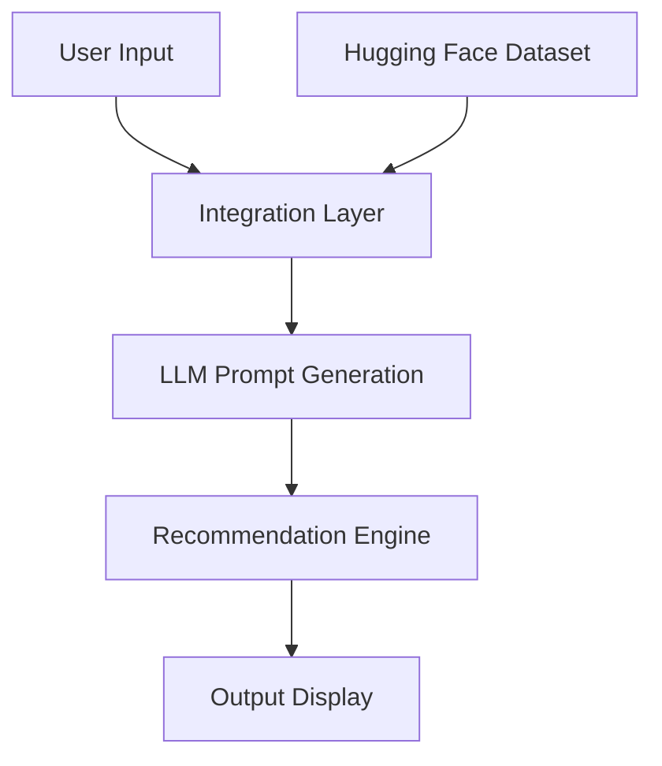

# AI-Powered Restaurant Recommendation System (Zomato Use Case)

## Overview
This document outlines the context and requirements for building an AI-powered restaurant recommendation service inspired by Zomato. The system intelligently suggests restaurants based on user preferences by combining structured data with a Large Language Model (LLM).

## Objective
Design and implement an application that:
- Takes user preferences (such as location, budget, cuisine, and ratings).
- Uses a real-world dataset of restaurants.
- Leverages an LLM to generate personalized, human-like recommendations.
- Displays clear and useful results to the user.

## System Workflow

### 1. Data Ingestion
- **Source:** Zomato restaurant recommendation dataset from Hugging Face: [ManikaSaini/zomato-restaurant-recommendation](https://huggingface.co/datasets/ManikaSaini/zomato-restaurant-recommendation)
- **Extracted Fields:**
  - Restaurant Name
  - Location
  - Cuisine
  - Cost
  - Rating
  - (and other relevant fields...)

### 2. User Input
Collect and process the following user preferences:
- **Location:** (e.g., Delhi, Bangalore)
- **Budget:** (low, medium, high)
- **Cuisine:** (e.g., Italian, Chinese)
- **Minimum rating**
- **Additional preferences:** (e.g., family-friendly, quick service)

### 3. Integration Layer
- Filter and prepare relevant restaurant data based on user input.
- Pass structured results into an LLM prompt.
- Design a prompt that helps the LLM reason and rank options.

### 4. Recommendation Engine
Leverage the LLM to:
- Rank restaurants based on matched criteria.
- Provide tailored explanations for why each recommendation fits.
- Optionally summarize the choices.

### 5. Output Display
Present the top recommendations in a clean, user-friendly format containing:
- **Restaurant Name**
- **Cuisine**
- **Rating**
- **Estimated Cost**
- **AI-generated explanation**
